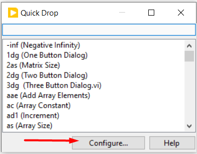
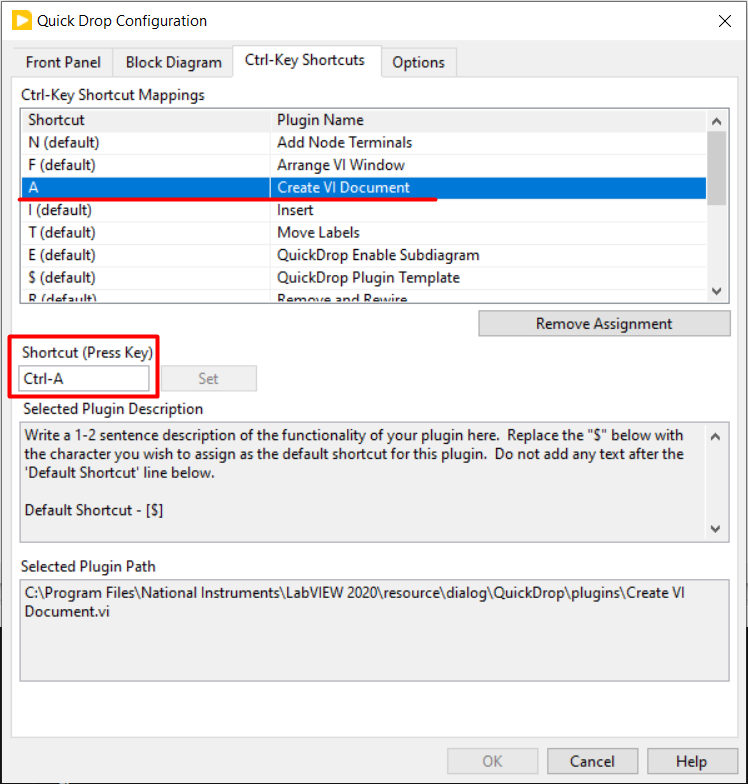

# About This quick drop
This quick drop documents the VI from where it is activated.

# Usage Instructions
1. **Enter OpenAI Key:** In the block diagram of `Main_lv_documentation.vi.vi`, enter your OpenAI API key.
2. **Place the quick drop vi in plugin:** Place the `Document VI.vi` in `C:\<Program Files>\National Instruments\<LabVIEW 20xx>\resource\dialog\QuickDrop\plugins`.
3. **Add short cut for quick drop:** Open quick drop. Click on Configure in it.

Add Ctrl-Key shortcut, any key as your wish as shown in below image

4. **Try using quick drop:** Open the Vi you need to document. Open quick drop in front panel or in block diagram and press Ctrl+`Shortcut Key` you added. Then the VI documentaion is created and shown in the pop up. Then option to update the controls and indicators Description, Tip Strip and VI description will shown. On clicking `OK` it will be updated. On Clicking `Cancel` it will not be updated. Also another pop up will be shown. Browse and provide the required file to save the vi description.